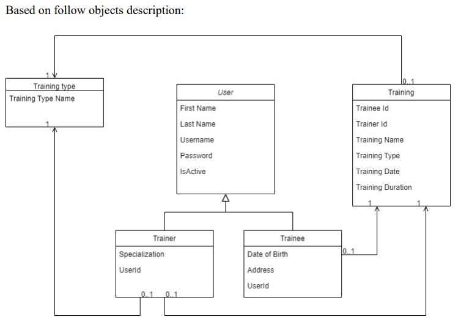

### Project type: web application

### Data flow:

Run: 
- 'docker-compose up -d' in terminal, 
- 'gym-crm-system-api' application, 
- 'trainer-workload-api' application.
To see ActiveMQ console, go to [http://localhost:8161/admin/queues.jsp()], login: 'admin', password: 'admin'.