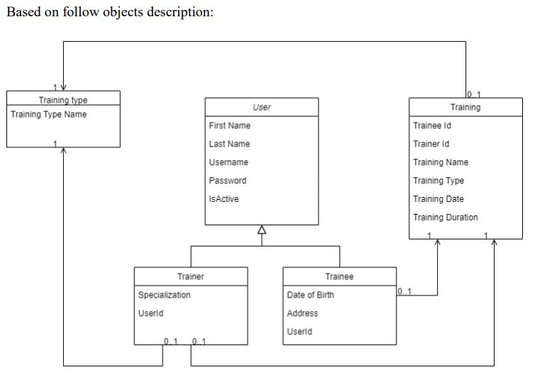

### Project type: web application

### Data flow:

Run:
- create, fill, add '.env-local-dev' to the root folder of project
(
  SPRING_DATASOURCE_USERNAME='your username'
  SPRING_DATASOURCE_PASSWORD='your password'
  SPRING_SERVER_PORT='your port'
  SPRING_SERVER_PORT_WORKLOAD='your another port'
),
- 'docker.desktop' on your PC,
- 'mvn clean package' in Execute Maven Goal,
- 'docker compose --env-file .env-local-dev up -d' in terminal.

To see available endpoints, go to [http://localhost:8080/swagger-ui.html](). 
Default admin credentials: login 'defaultadmin', password "qwertyuiop'.

To see available endpoints, go to [http://localhost:8081/swagger-ui.html]().

To see ActiveMQ console, go to [http://localhost:8161/admin/queues.jsp()], login: 'admin', password: 'admin'.

After work run:
- 'docker compose --env-file .env-local-dev down' in terminal.